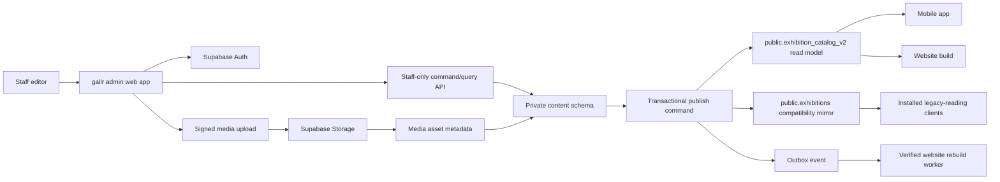

# Exhibition content architecture and Sheet retirement runbook

## Outcome

The target system has one canonical PostgreSQL content model, one staff admin
application, and one controlled publishing path. Google Sheets and Apps Script
stop being a database and become, at most, a temporary migration input.

The implementation is intentionally split into a private editorial model and a
stable public projection. Drafts never leak to the mobile app or website, and a
published exhibition keeps the same permanent ID for bookmarks, thoughts, and
links.

## High-level architecture



### Responsibilities

| Layer | Responsibility |
| --- | --- |
| Admin web app | Staff workflow, paired-coordinate and URL validation, event/editor association selectors, preview, revision-conflict UI |
| Supabase Auth | Staff identity only; no public staff sign-up |
| `content.staff_members` | Authoritative contributor, publisher, and admin roles |
| `content.exhibitions` | Permanent, immutable exhibition identity and current published pointer |
| `content.exhibition_versions` | Draft, published, and superseded snapshots |
| `content.venues` | Reusable venue defaults; published versions retain snapshots |
| `content.media_assets` | Shared byte identity, immutable source/delivery paths, state, MIME, size, dimensions, checksum, and purge state |
| `content.exhibition_version_media` | Version-scoped cover/gallery role, explicit ordering, focal point, alt text, credit, and rights |
| `content.curation_placements` | App and homepage placement independent of exhibition copy |
| `content.audit_log` | Append-only editorial and bridge activity; caller roles cannot directly insert, update, delete, or truncate rows |
| `content.outbox_events` | Reliable rebuild and downstream delivery queue |
| Public projection | Backward-compatible, published-only contract for shipped clients |
| Legacy compatibility mirror | Disabled-by-default canonical-to-legacy bridge for installed clients during the rollback window |

The `content` and `content_private` schemas must remain outside the Supabase Data
API exposed-schema list. Browser clients receive only narrowly scoped query and
command functions. The service-role key is restricted to trusted workers.

## Editorial workflows

### Add an exhibition

1. A staff member signs in. The server verifies an active
   `content.staff_members` record.
2. `admin_create_exhibition_draft` generates a permanent UUID and inserts the
   `content.exhibitions` identity.
3. The same transaction creates draft version 1 with revision 1.
4. The admin opens the new draft. The permanent ID is visible but not editable.
5. The editor enters Korean-first bilingual copy, venue/place snapshots,
   schedule, public contact, a required Korean address, paired WGS-84
   coordinates, the exhibition's own ticket URL, optional event/editor
   associations, and curation choices.
6. Each save passes both the exact working-version UUID and
   `expected_revision`. The server increments the revision; a stale editor or
   mismatched identity/version pair receives a conflict instead of overwriting
   newer work.
7. Media follows the upload workflow below and is attached to the draft.
8. Preview renders the in-memory draft and its exact public JSON projection.
9. A publisher confirms publication. One database transaction validates the
   record, marks the new version published, supersedes the previous version,
   advances `published_version_id`, writes audit history, and queues an outbox
   event.
10. Public clients continue reading only the published projection.

### Edit a published exhibition

1. The first save to a published record atomically creates or reuses one
   editable draft derived from the current published snapshot.
2. Saves update only that draft and use its revision number.
3. The live app and website keep reading the previous published version.
4. Preview shows the pending version and lists the fields that changed.
5. Publishing atomically swaps the identity's published pointer. Old versions
   remain for audit and rollback.

### Edit location, ticketing, and associations

1. A draft may remain incomplete while copy is being prepared, but publication
   requires a nonblank Korean address and both WGS-84 coordinates. Latitude
   accepts -90 through 90 and longitude accepts -180 through 180. The
   controlled form keeps intermediate input as text; the command boundary
   normalizes a blank draft pair to database `NULL` and rejects a partial or
   out-of-range pair. The database independently rejects every newly published
   version that lacks the required address or coordinate pair.
2. The editor can search coordinates using only the Korean address. The admin
   sends that address to an authenticated server-side geocoding endpoint, which
   calls NAVER Cloud Geocoding with credentials held only in server secrets.
   The endpoint returns a small candidate list containing the normalized road
   and lot-number addresses plus WGS-84 latitude/longitude. It never writes the
   draft directly.
3. The editor reviews the candidates and explicitly applies one result. Applying
   a candidate updates the address and coordinate fields through the same
   revision-guarded autosave as manual edits. No result or multiple plausible
   results is a visible review state, never an automatic best guess. Manual
   coordinate correction remains available for gallery entrances or map pins
   that differ from the postal address.
   Local UI work may opt into NAVER's official browser SDK with a public,
   origin-restricted client ID. That adapter is development-only and never uses
   a client secret; production always uses the authenticated Edge Function so
   provider credentials stay server-side.
4. Enter only the exhibition-specific ticket link. A non-empty value must be an
   absolute HTTP or HTTPS URL, and a blank becomes `NULL`. Neither the editor nor
   the compatibility projection implicitly falls back to the associated event's
   ticket URL.
5. Choose optional event and editor associations by stable ID. One
   staff-checked `admin_get_exhibition_lookups()` RPC returns both catalogs in a
   single round trip. It includes inactive references so a historical assignment
   does not disappear from the editor.
6. Details and association changes share one revision-guarded autosave patch.
   One accepted autosave creates or updates one working version and increments
   its revision once; it does not issue a second association mutation.
7. These fields do not change the media contract. Cover/gallery operations keep
   their own exact-version and revision checks, and publication keeps the same
   media-readiness gate.

For normal association removal, select **No linked event** or **No editor
attribution** on the exhibition. To retire a reference globally, mark its
source row inactive rather than deleting it. Inactive rows stay visible in the
lookup response and preserve historical meaning.

The event catalog still has a legacy Sheet/Apps Script owner. A missing event in
that source can be deleted by its sync, and today's `ON DELETE SET NULL` foreign
key can then clear associations from version history. Do not hard-delete event
or editor rows during coexistence. Change the canonical event/editor foreign
keys to `ON DELETE RESTRICT` only after the event Sheet writer is retired and
the final event snapshot is reconciled; enabling it earlier can break the
legacy sync rather than complete the migration safely.

### Compatibility and public-reader behavior

Draft edits remain private. Publication places coordinates, association IDs,
and the exhibition ticket URL in the canonical published version. A private
transaction trigger then refreshes the flat `public.exhibition_catalog_v2` row
before the publication transaction can commit. The projection uses the legacy
field names and null semantics, never reads event ticketing as a fallback, and
prefers a published CMS cover before the retained legacy cover URL.

The bridge runtime records two independent booleans so “not mirroring” cannot
accidentally mean “the Sheet may write”:

| State | `legacy_mirror_enabled` | `legacy_writes_blocked` | Writer |
| --- | --- | --- | --- |
| Sheet-owned | `false` | `false` | Sheet/Apps Script, before ownership transfer only |
| Canonical-owned | `true` | `true` | Canonical publish commands; both public catalogs update transactionally |
| Frozen | `false` | `true` | None; diagnose and reconcile before any separately approved recovery |

Before final ownership transfer, the bridge is Sheet-owned. Enabling the mirror
is a deliberate service-role operation that requires a nonblank reason and the
previously reviewed V2 row count, ID hash, and catalog hash. The activation
transaction locks both public catalogs and requires exact ID, field, and
checksum parity with the canonical source before it changes ownership. A failed
or stale precondition changes nothing.

After activation, each canonical projection transaction also updates or deletes
the matching legacy row. This keeps installed legacy-reading mobile binaries
fresh and leaves the `legacy` reader setting usable for a reader-only rollback.
Activation revokes `service_role` insert, update, delete, and truncate on
`public.exhibitions`; the ownership guard also rejects direct or already-queued
legacy writes. The Sheet trigger must already be disabled before activation.
Freezing the bridge sets the frozen state, leaves that guard active, and
idempotently revokes the same DML privileges again so privilege drift cannot
create a second writer. Enable and freeze RPCs append operational evidence to
`content.audit_log`; caller roles cannot rewrite or erase those events directly.
This is append-only operational evidence, not a cryptographic guarantee against
the PostgreSQL owner or infrastructure administrator.

Web and mobile own one strict reader-source pair: `legacy` (the default) or
`canonical-v2`. V2 adds a database-derived row content checksum so a complete
keyset read detects both ID membership changes and in-place field changes. No
reader is switched merely by deploying the additive database migration. The old
endpoint remains available and canonically synchronized throughout the rollback
window after ownership transfer.

### Remove or restore an exhibition

1. Use archive for normal removal; do not hard-delete editorial records.
2. A publisher sets `archived_at` and `archived_by` through a command function.
3. The public projection excludes the archived identity immediately.
4. Bookmarks, thoughts, version history, and media references remain intact.
5. Restore clears the archive fields. A retained published version becomes
   public again; a draft-only identity remains private. Curated placements stay
   disabled until an explicit publish.
6. Reserve hard deletion for an administrator-only privacy or legal runbook.

## Image storage workflow

Use database metadata as the source of truth and Storage only for bytes.

1. The editor selects JPEG, PNG, or WebP. The client rejects files above the
   configured limit before upload.
2. `admin_request_media_upload` creates a `pending_upload` asset and returns a
   server-generated private path under
   `drafts/{exhibition_id}/{asset_id}/original.{ext}`.
3. The authenticated browser obtains a short-lived, object-scoped signed upload
   token and uploads directly to private Storage. Bytes never pass through the
   admin server and existing objects are never overwritten.
4. `admin_finalize_media_upload` verifies that the registered object exists and
   that Storage MIME and size match the reservation, then moves it to `ready`.
5. Attaching it as cover or gallery increments the draft revision and enqueues
   one deduplicated `media.publish_requested` event.
6. A service-only worker validates the complete container, fully decodes JPEG,
   PNG, or WebP pixels with strict resource limits, computes SHA-256, and copies
   the bytes to `exhibition-images/cms/{asset_id}/original.{ext}`.
7. Only after the public copy is verified does the asset become `published` and
   expose its stable URL. Publication is blocked while any attached asset is not
   published; an exhibition with no media remains valid.
8. Alt text, credit, rights URL, role, and order are version-specific, so editing
   a draft never mutates an older published version.
9. A final detach turns an unreferenced ready, published, or rejected asset into
   `orphaned`; the worker deletes Storage objects through the API and records
   `purged_at`. A bounded sweep handles abandoned uploads older than 24 hours.

Do not overwrite published object paths. Content-addressed or versioned paths
make CDN caching and rollback predictable.

## Roles and permissions

| Role | Allowed actions |
| --- | --- |
| Contributor | Read editorial data; create identities, drafts, venues, and pending media; edit drafts |
| Publisher | Contributor actions plus publish, archive/restore, curation, and submission review |
| Admin | Publisher actions plus staff membership and emergency operations |

RLS is defense in depth. Publication, staff changes, and storage finalization
also require security-definer command functions with an empty `search_path`,
explicit validation, and minimal execute grants.

## Current implementation status

Completed locally:

- CLI-compatible bridge for the legacy `005b` profiles/bookmarks migration.
- Private content schemas, versioned exhibition model, venues, media metadata,
  curation, submissions, audit log, outbox, RLS, indexes, and least-privilege
  grants.
- Private `exhibition-media` bucket with a 10 MiB limit and an image-only MIME
  allowlist; it has no blanket browser write policy.
- `profiles.is_admin` is now a derived compatibility mirror; profile owners
  cannot promote themselves.
- Thought authors cannot self-approve moderation state.
- Authenticated public RPC wrappers backed by private, role-checked
  command/query implementations for staff and association lookup, list/get,
  create/save, publish/archive/restore, and the complete media command surface.
- Exact version UUID plus revision concurrency, atomic published-to-draft clone,
  immutable published snapshots, one-draft/one-published invariants, patch
  allowlisting, Asia/Seoul reception-date conversion, audit entries, and
  deduplicated publish/archive/restore outbox events.
- Paired coordinate editing, exhibition-specific ticket URLs, optional
  event/editor selectors, and one staff-only combined lookup RPC that retains
  inactive references. Scalar and association edits save as one revision.
- Signed immutable uploads; version-scoped media presentation; cover
  replacement, gallery ordering, detach/rejected cleanup, and publication
  guards.
- Request-UUID idempotency for publish/archive/restore and a service-only outbox
  API with single-event leases, bounded retry, dead-letter handling, stale-media
  sweep, and race-safe purge tokens.
- A custom-token Edge worker that fully validates and decodes supported images,
  verifies immutable public delivery, cleans Storage through its API, and
  forwards non-media events with idempotency headers.
- A deterministic, dependency-free legacy export reviewer that preserves
  database IDs, compares the publishable Sheet rows, fingerprints every source,
  and emits an immutable staging bundle plus issue/reconciliation reports.
- Private legacy import batches, submitted/normalized rows, durable provenance
  links, atomic apply/revision logic, and service-only compatibility previews.
- Import apply is idempotent, rejects invalid rows and canonical/admin conflicts,
  rejects out-of-order full snapshots, reports missing IDs without archiving
  them, and keeps legacy cover URLs as a fallback without fabricating media
  metadata.
- Each stage records the latest applied-batch baseline; apply rejects baseline
  drift so reviewed actions and missing-ID evidence cannot silently go stale.
- Authenticated direct canonical writes are revoked; browser mutations go
  through commands only.
- The pgTAP suites cover the schema, commands, media lifecycle, idempotency,
  leases, worker privileges, editable reference fields, legacy
  import/reconciliation, and failure paths. The Node tests cover the offline
  bundle workflow.
- Standalone React admin with deterministic fixture mode and a live Supabase
  mode, email/password AuthGate, active staff-role checks, defensive RPC mapping,
  create/edit/autosave/preview/publish/archive/restore, explicit confirmations,
  role-aware controls, and a responsive Media workspace with upload,
  replace/remove, ordering, metadata, processing status, and publish blocking.
- Passing component/repository/auth tests, a clean production build, and a local
  browser E2E covering sign-in through publish, clone-on-edit, archive, restore,
  sign-out, and media interaction at desktop and mobile sizes.
- Complete public-reader transport for the website, mobile catalog, featured
  feed, and event detail: indexed 500-row ID keysets drain to an explicit empty
  page, reject duplicate IDs, verify a single-snapshot count/SHA-256 membership
  checksum, retry one unstable attempt, and fail without exposing a prefix.
- A tracked legacy `ticket_url` compatibility column, event/featured reader
  indexes, an RLS-preserving anonymous integrity RPC, boundary tests at 999,
  1,000, 1,001, and 1,205 rows, and a real local PostgREST proof across the
  server's 1,000-row cap. Cleanup is count- and provenance-guarded; the final
  clean reset removed the reserved-cursor fixture and restored a reconciled
  zero-row baseline.
- A dedicated, flat `public.exhibition_catalog_v2` read model with anonymous
  read-only RLS, no private-schema grants, published-only constraints, event,
  featured, and homepage indexes, transactionally maintained source triggers,
  migration backfill, and service-role-only drift reconciliation.
- A disabled-by-default canonical-to-legacy compatibility mirror for installed
  clients. Its service-only activation requires exact catalog parity plus a
  recorded expected count, ID hash, catalog hash, and reason; it then revokes
  legacy service-role DML and guards the table from queued or direct writes.
  Runtime state distinguishes Sheet-owned (`false`/`false`), canonical-owned
  (`true`/`true`), and frozen (`false`/`true`) modes. Disabling the mirror is an
  audited freeze: it leaves the ownership guard active, idempotently revokes DML,
  and does not restart the Sheet writer.
- Append-only operational evidence for mirror enable/freeze transitions. Bridge
  RPCs append through owned command functions, while caller roles cannot directly
  insert, update, delete, or truncate `content.audit_log`.
- V2 row-content checksums and a stable invoker integrity RPC that verifies
  count, database-ordered ID membership, and field content across multi-page
  reads. Web and mobile can select V2 only through the closed
  `canonical-v2` resource/RPC pair; every production-facing default remains
  `legacy` until cutover approval.
- Before the address/geocoding slice, the final clean local reset applied every
  then-tracked migration and all eight then-existing pgTAP suites passed 498
  assertions, including the 92-assertion V2 lifecycle/security suite. The
  two-session harness proved both queued-legacy-writer rejection and concurrent
  canonical-source convergence; schema lint reported no errors and security
  advisors reported no error-level findings. An actual local PostgREST rehearsal
  returned exactly 1,205 canonical rows in 500/500/205/0 pages with one matching
  count, membership, and content-integrity snapshot. Final state was reconciled
  at zero rows with Sheet-owned runtime (`false`/`false`) and an empty private
  write context. Incremental address/geocoding verification is recorded in the
  pull request; do not treat the historical 498 count as a clean-stack result for
  newly added migrations or suites.

Intentionally not completed yet:

- This branch does not perform or authorize any hosted migration, NAVER secret
  mutation, Edge Function deployment, data backfill, or cutover.
- No production legacy exhibition backfill or reader activation. The V2
  projection and source flags are implemented locally, but shipped clients
  still default to the legacy `public.exhibitions` table.
- Events still have a separate Sheet/Apps Script workflow. Its delete behavior
  makes hard deletion unsafe and prevents switching association foreign keys to
  `ON DELETE RESTRICT` until the event writer is retired.
- The outbox worker is implemented locally but is not deployed or scheduled;
  the production downstream rebuild receiver and audited replay operation still
  need to be implemented.
- No staff invitation/management UI or command; production staff must come from
  an independently approved UUID allowlist.
- No focal-point editor, upload progress meter, version-history UI,
  reload/compare conflict resolver, or navigation/unload guard.
- No audited frozen-to-Sheet-owned recovery command. Until a separate
  parity-gated owner operation is implemented and rehearsed, editorial rollback
  can freeze writes but cannot safely restart the Sheet pipeline.
- Google Sheets and Apps Script remain active until the cutover gates pass.

## Local setup and verification

1. Start Docker Desktop.
2. Use a trusted local machine, firewall, or isolated VM. From the repository
   root, start the local stack and immediately inspect every published binding:

   ```bash
   supabase start
   docker ps --filter 'name=supabase_' --format 'table {{.Names}}\t{{.Ports}}'
   ```

   Stop immediately with `supabase stop --no-backup` if any service is published
   on `0.0.0.0` or `[::]`; do not continue until the stack is isolated from
   untrusted networks. A custom Docker network alone is not proof of loopback
   binding—verify the displayed ports each time.

3. Recreate the database from migrations:

   ```bash
   supabase db reset --local --no-seed
   ```

4. Verify migration history and database behavior:

   ```bash
   supabase migration list --local
   supabase db lint --local --schema public,content,content_private --fail-on error
   supabase db advisors --local --type security --fail-on error
   supabase test db supabase/tests/database --local
   ```

5. Run the admin application in another terminal:

   ```bash
   cd admin
   npm install
   npm run dev
   ```

6. Before handing off a change, run:

   ```bash
   cd admin
   npm run typecheck
   npm test
   npm run build
   ```

## Step-by-step implementation sequence

### Phase 1 — Foundation (implemented locally)

1. Reconcile the skipped `005b` migration with an idempotent numeric bridge.
2. Create private canonical schemas and staff-role authority.
3. Add stable identities, immutable versions, venue snapshots, media metadata,
   curation, audit, outbox, and private submission records.
4. Create the private, constrained media bucket without a blanket upload policy.
5. Enable RLS and revoke default grants before granting exact operations.
6. Add pgTAP tests for schema, privileges, roles, constraints, and escalation
   attempts.

### Phase 2 — Command and query API (core implemented locally)

1. **Implemented:** staff-only list/get queries returning the typed editor DTO.
2. **Implemented:** `admin_create_exhibition_draft()` with a server-generated
   permanent UUID and draft v1.
3. **Implemented:** `admin_save_exhibition_draft(id, version_id, revision,
   payload)` with atomic clone-on-edit and stale/cross-identity rejection.
4. **Implemented:** publisher-only transactional publish, archive, and restore
   with audit and deduplicated outbox enqueue.
5. **Implemented:** signed media request/finalize/attach/detach/reorder commands
   and object-scoped Storage policies.
6. **Implemented:** request-ID idempotency for publisher commands.
7. **Implemented locally:** lease-token outbox claim/complete/fail functions and
   a trusted worker with byte validation, cleanup, bounded retry, and
   dead-letter behavior. Deployment, scheduling, and the downstream receiver
   remain gated.

### Phase 3 — Connect the admin application (core implemented locally)

1. **Implemented:** email/password staff sign-in, signed-out/checking/inactive/
   non-staff states, and role-aware publish/lifecycle controls.
2. **Implemented:** `SupabaseAdminExhibitionRepository` with defensive DTO
   validation and structured revision-conflict mapping.
3. **Implemented:** environment-selected live adapter plus deterministic
   in-memory adapter for tests and design review.
4. **Implemented:** create, autosave, preview, publish, archive/restore
   confirmations, published-to-draft editing, and keyboard-complete dialogs.
5. **Implemented:** paired-coordinate and absolute ticket-URL validation,
   event/editor association selectors backed by one staff-only lookup, and
   single-revision details autosave.
6. **Implemented:** signed upload, validation status, replace/remove, ordering,
   alt/credit/rights editing, polling, publication blocking, and media-specific
   revision-conflict handling.
7. **Implemented locally:** required Korean map address plus valid coordinates
   at publication, explicit address-candidate selection in the editor, and a
   staff-protected server-side NAVER geocoding adapter. Deployment and the
   existing-record location backfill remain cutover gates.
8. **Next:** add reload/compare conflict resolution, navigation/unload guards,
   version-history UI, and automated live contributor/publisher browser tests.

### Phase 4 — Backfill and compatibility

1. **Operator action pending:** export the Google Sheet, `public.exhibitions`,
   events, and editors from one quiet-window snapshot into checksum-protected,
   read-only artifacts.
2. **Implemented locally:** run the deterministic offline reviewer for source
   counts, duplicate permanent IDs, invalid dates, missing fields, bad URLs,
   orphan-reference inputs, Sheet/public drift, and GAS-ID diagnostics.
3. **Implemented locally:** stage every submitted row and its server-normalized
   copy, retaining invalid rows and structured issues instead of dropping them.
4. **Implemented locally:** map each valid legacy database ID to a stable
   identity and published version; changed imports create a version, identical
   imports are idempotent, and missing IDs never imply archive.
5. **Implemented locally:** preserve `cover_image_url` as
   `legacy_cover_image_url`; do not download bytes or create a fake media asset.
6. **Implemented locally:** expose exact compatibility fields through a
   service-role-only `security_invoker` preview. Anonymous cutover remains a
   separate architecture decision.
7. **Implemented locally:** reconcile source and preview by ID, count, field
   checksum, event/editor association, flags, timestamps, and cover URL.
8. **Operator action pending:** rehearse on an isolated staging clone and
   resolve every difference or record one exact, approved exception-ledger row.

Detailed decisions and commands are in
[ADR-0001](adr/0001-staged-postgres-cms-cutover.md) and the
[legacy import operator runbook](legacy-exhibition-import-runbook.md).

### Completed cutover prerequisite — complete-reader pagination

The legacy web and mobile fetches previously requested an unpaginated
collection. Supabase/PostgREST could return only the first 1,000 rows without
making the omission obvious, so a successful first-page smoke test was not
sufficient cutover evidence.

This prerequisite is now implemented locally. Both readers use PostgreSQL-owned
`id ASC` keysets, bounded 500-row requests, a global duplicate guard, and an
explicit empty terminal page. They compare the assembled count and UTF-8
length-prefixed ID SHA-256 with one `SECURITY INVOKER` database snapshot. A
mismatch discards all pages and retries once; HTTP, decoding, DTO, or permanent
integrity failures expose no prefix. Presentation order is applied afterward,
with equal opening dates preserving the verified database ID order.

Unit coverage includes 999, 1,000, 1,001, 1,205, server-shortened pages,
same-count replacement, malformed integrity payloads, and later-page failures.
A real local PostgREST run returned 1,205 unique rows in four data requests,
observed the empty terminal page, and matched count/checksum. Detailed rollout
and rollback instructions are in
[the public reader pagination runbook](public-reader-pagination-runbook.md) and
the decision is recorded in
[ADR-0002](adr/0002-complete-reader-keyset-pagination.md).

### Completed cutover implementation — transactional V2 public catalog

The anonymous architecture decision is now implemented locally without changing
production traffic. `public.exhibition_catalog_v2` is a real flat table rather
than a public view over private draft/version tables. Anonymous and authenticated
roles can select it through RLS but cannot mutate it, and they retain no access
to `content` or `content_private`.

One idempotent private projector either upserts the exact unarchived published
snapshot or removes the public row. Narrow triggers cover identity publication
and archive state, published-version fields, curation, current cover attachments,
and current cover assets. Because they run in the source transaction, a
projection constraint or write failure rolls the canonical command back instead
of creating eventual drift. Migration backfill uses the same source query, and
`admin_reconcile_exhibition_catalog_v2()` compares every business field and
database-derived checksum afterward.

The V2 integrity endpoint retains ADR-0002's count and framed ID hash and adds a
catalog hash over each row's database-derived content hash. Clients therefore
discard a multi-page attempt when the same ID changes fields mid-read. The web
build, showcase, seed refreshes, mobile catalog/featured feed, and event detail
all resolve either the complete `legacy` pair or complete `canonical-v2` pair;
unknown values fail configuration and no request silently crosses sources.

The decision is recorded in
[ADR-0003](adr/0003-transactional-public-exhibition-catalog.md). Exact staging,
canary, freeze, rollback, monitoring, and retirement steps are in the
[public catalog cutover runbook](public-exhibition-catalog-cutover-runbook.md).

### Phase 5 — Controlled cutover

1. Build an independently verified allowlist of production staff UUIDs. The
   migration deliberately does not trust or promote legacy `profiles.is_admin`
   values because owners could previously edit that field.
2. Confirm production's PostgreSQL major version and take a database backup.
3. Inspect linked migration history. The bridge version is `000` because the CLI
   skips `005b`; do not run `db push --include-all` blindly. Repair history only
   after confirming the bridge objects already exist.
4. Apply migrations to a populated staging clone, measure and retain the V2
   migration's wall-clock and write-blocking lock duration, verify the backfill
   and service-only reconciliation, and rerun all tests and advisors. The
   rehearsal is incomplete without lock evidence against representative data.
5. Seed `content.staff_members` only from the approved UUID allowlist, deploy
   the admin read-only, then enable writes for two staff canary users.
6. Publish test records and verify mobile, website, audit, outbox, V2 field
   checksums, and rollback.
   Reader verification must include eagerly drained keyset pages beyond 1,000
   rows and an exact published-ID count/checksum; a first-page success is a
   failed gate.
7. Canary the website and mobile builds through the explicit `canonical-v2`
   source pair while production remains reversible. This canary is
   observation-only: before the final quiet-window delta, it does not prove that
   canonical data equals the still-live Sheet catalog.
8. Schedule a content freeze. Run the final Sheet delta import and comparison.
9. Disable the Apps Script write/sync trigger, make the Sheet read-only, and
   record the reviewed V2 count, ID hash, and catalog hash.
10. Enable the compatibility mirror with those three expected values and a
    nonblank cutover reason. Activation must prove exact canonical, V2, and
    legacy payload parity; it then revokes legacy service-role DML. Publish
    exclusively through the admin. Retain the regression evidence that a legacy
    writer queued behind the ownership lock is rejected after lock release.
11. Monitor projection reconciliation, legacy-mirror parity, reader integrity,
    errors, revision conflicts, publish latency, rebuild delivery, and record
    counts for at least one editorial cycle.
12. Archive the Sheet export and Apps Script source; remove runtime credentials
    only after the rollback window closes.

## Rollback boundary

Before readers are activated on V2, rollback is simply leaving their source on
`legacy` and disabling admin writes. After mirror activation, a reader-only
rollback sets readers back to `legacy` while leaving the canonical-to-legacy
mirror enabled; installed and rolled-back clients therefore continue to receive
current canonical publications.

If editorial ownership itself must roll back, first pause canonical publishing
and call `admin_disable_legacy_exhibition_mirror(text)` with a nonblank incident
reason. This is a freeze: it stops canonical mirroring but deliberately does not
restore legacy DML or restart Apps Script. It sets
`legacy_mirror_enabled=false` and `legacy_writes_blocked=true`, leaves the
ownership guard active, and idempotently revokes legacy DML again. Resuming the
Sheet requires a separately approved reconciliation of every canonical command
accepted since the final export, followed by a separately implemented,
parity-gated, audited owner operation that atomically changes the runtime to
Sheet-owned (`false`/`false`) and restores the exact legacy DML grants. That
recovery operation is intentionally not implemented yet; a standalone privilege
regrant does not clear the guard and is forbidden. Activate Apps Script only
after that reviewed operation commits. Never run Sheet and admin writers
concurrently. Retain the public tables, immutable export, audit, and outbox
evidence while the defect is diagnosed.
