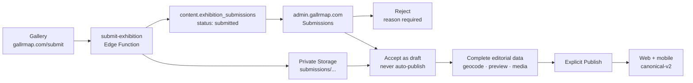

# Gallery exhibition submission workflow

This document describes the canonical, Sheet-free path from the public
`/submit/` form to a published exhibition. A public submission is always
untrusted input. It can create a review record, but it cannot create or change a
public exhibition without an authenticated staff decision.

## Data flow

The Google Sheet, Apps Script `FormEndpoint.gs`, and the legacy
`public.exhibitions` writer are not part of this path.

## What the gallery experiences

1. The gallery opens `https://gallrmap.com/submit/`.
2. It enters the exhibition, venue, dates, Korean address, hours, contact email,
   and any optional bilingual copy, reception time, and images.
3. The browser validates obvious mistakes and sends a native multipart request
   to the public `submit-exhibition` Edge Function.
4. The function repeats all validation on the server, applies global,
   email-scoped, and IP-scoped rate limits, validates image bytes, and stores
   accepted images under immutable private paths.
5. On success, the page displays the submission UUID as the receipt. The
   submission is not public and no publication promise is made.

Images are optional. When supplied, at most five JPEG or PNG files are accepted,
with a 6 MiB limit per file. Storage paths use
`submissions/{submission_id}/{asset_id}/original.{jpg|png}`. The bucket remains
private; the public form never receives a service-role credential.

## What staff see in Gallr Admin

Sign in at `https://admin.gallrmap.com/` and choose **Submissions** in the
primary navigation.

The queue provides:

- search across exhibition, venue, and submitter email;
- filters for Submitted, In review, Accepted, and Rejected;
- submitted metadata and short-lived previews of private images;
- the submitter email for review only;
- Start review, Reject, and Accept as draft actions.

Starting review changes `submitted` to `in_review`. Rejecting requires a reason.
Accepting is idempotent and creates one canonical, unpublished exhibition draft.
It never publishes directly. The first submitted image becomes the draft cover
and later images become ordered gallery media. The submitter email is not copied
into the exhibition's public contact field.

After acceptance, Admin opens the new draft in **Exhibitions**. Staff must:

1. verify and edit Korean/English copy;
2. find or enter valid map coordinates from the required Korean address;
3. verify dates, hours, public contact, event, and editor references;
4. add image alt text, credit, and rights information;
5. run the media worker until attached images are published;
6. preview the result; and
7. choose **Publish** explicitly.

The normal archive, restore, and protected never-published-draft deletion rules
apply after acceptance.

## Security and operational boundaries

- The Edge Function is public (`verify_jwt = false`), but only its server-side
  Supabase secret may execute the intake and pre-upload rate-limit RPCs.
- `SUBMISSION_HASH_SECRET` must be a generated secret of at least 32 characters.
- `SUBMISSION_ALLOWED_ORIGINS` must contain only the exact production and
  intentional preview origins.
- Database functions validate and copy only allowlisted payload keys.
- Public callers cannot list submissions or read private media.
- Only authenticated active publishers/admins can review submissions.
- Review acceptance creates a draft and audit/outbox evidence; it does not
  bypass publication guards.
- A failure to sign one image preview degrades that image to
  **Preview unavailable** instead of hiding the queue.

## Deployment and smoke test

Roll out in staging first:

1. Apply migration `20260730051702_canonical_submission_review.sql`.
2. Set `SUBMISSION_HASH_SECRET` and `SUBMISSION_ALLOWED_ORIGINS` for the
   `submit-exhibition` function.
3. Deploy `submit-exhibition` and the updated `outbox-worker`.
4. Configure the web build with `GALLR_SUBMISSION_ENDPOINT`, or with
   `SUPABASE_URL` so Eleventy derives
   `/functions/v1/submit-exhibition`.
5. Submit one clearly named staging record with one small valid image.
6. Confirm it appears in Admin → Submissions without appearing publicly.
7. Start review, verify that rejection requires a reason, then accept a fresh
   submission as a draft.
8. Confirm the accepted record is still unpublished and incomplete publication
   remains blocked.
9. Complete coordinates/editorial metadata, process media, publish, and verify
   web/mobile detail and map behavior.
10. Archive or delete the staging test records according to their publication
    history.

Production rollout should repeat the same checks under the existing guarded
change process. It does not require re-enabling Sheet triggers or editing the
legacy workbook.
