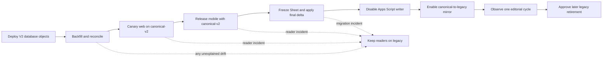

# Public exhibition catalog cutover runbook

## Purpose and safety boundary

This runbook moves exhibition readers from the Google Sheet-fed
`public.exhibitions` table to the canonical, published-only
`public.exhibition_catalog_v2` read model. It does not retire the separate event
or editor workflows.

Do not run the production steps until the content, backend, web, and mobile
owners have approved the maintenance window, rollback owner, immutable exports,
and staff allowlist. The migration is additive; keep the legacy table, RPC,
Sheet, Apps Script source, and credentials intact throughout the rollback
window. The exhibition Apps Script trigger is disabled at ownership transfer;
retaining it for recovery does not authorize restarting it.



## Source contracts

| Reader setting | Table | Integrity RPC | Intended use |
| --- | --- | --- | --- |
| `legacy` (default) | `public.exhibitions` | `public.exhibition_reader_integrity` | Current production; installed-client compatibility and reader rollback after mirror activation |
| `canonical-v2` | `public.exhibition_catalog_v2` | `public.exhibition_catalog_v2_integrity` | Staging, canary, then cutover |

The source is one closed pair. Never point the V2 table at the legacy integrity
RPC or vice versa. Never implement an automatic network-error fallback between
the two sources; it can make catalog, featured, and event pages disagree.

The canonical-to-legacy mirror is disabled by default. Before ownership
transfer, the Sheet pipeline owns `public.exhibitions`. After exact-parity
activation, canonical publication owns both public tables transactionally so
supported legacy-reading binaries remain fresh.

Treat the two runtime booleans as a three-state machine:

| State | `legacy_mirror_enabled` | `legacy_writes_blocked` | Allowed writer |
| --- | --- | --- | --- |
| Sheet-owned | `false` | `false` | Sheet/Apps Script before transfer |
| Canonical-owned | `true` | `true` | Canonical command path only |
| Frozen | `false` | `true` | None |

Never infer Sheet ownership from `legacy_mirror_enabled=false`; the frozen state
also has mirroring disabled while its legacy ownership guard remains active.

## Gate 0 — Assign owners and evidence locations

1. Name one cutover commander, one database operator, one content operator, one
   web owner, one Android owner, and one iOS owner.
2. Record the exact staging and production project references without copying
   service-role credentials into tickets or chat.
3. Create a restricted evidence directory for:
   - the database backup identifier;
   - final legacy database, Sheet, event, and editor exports;
   - SHA-256 values for every export;
   - migration history before and after deployment;
   - staging migration wall-clock and write-blocking lock duration;
   - reconciliation JSON;
   - reader count/checksum results;
   - queued legacy-writer rejection output;
   - append-only bridge audit-event verification;
   - canary build/deployment identifiers;
   - approval and rollback timestamps.
4. Agree on objective rollback thresholds before changing traffic. At minimum:
   any unexplained missing/extra/mismatched ID, repeated integrity failure,
   anonymous draft exposure, failed publish transaction, or broken event-scoped
   collection is a stop condition.
5. Prohibit hard deletion of event and editor rows for the entire coexistence
   window. Retire them by marking them inactive; their legacy writers and
   current foreign-key behavior are outside this exhibition cutover.
6. Decide whether the production rollback contract is freeze-only or must
   include Sheet resumption. If resumption is required, the separately audited
   frozen-to-Sheet-owned recovery operation described in rollback procedure
   step 5 must be implemented and rehearsed before ownership transfer.
7. From the exact reviewed commit, run the local-only staging preflight before
   loading any database credential. It refuses untracked or dirty rehearsal
   artifacts, identical staging/production references, an unreviewed commit,
   and an evidence directory inside the repository:

   ```bash
   export GALLR_EXPECTED_STAGING_PROJECT_REF='<approved-staging-clone-project-ref>'
   export GALLR_PRODUCTION_PROJECT_REF='<production-project-ref>'
   export GALLR_STAGING_EVIDENCE_DIR='<new-absolute-directory-outside-the-repository>'
   export GALLR_REVIEWED_COMMIT='<full-reviewed-git-commit>'
   export GALLR_CHANGE_RECORD='<approved-change-record>'
   export GALLR_EXECUTOR='<database-operator>'
   export GALLR_REVIEWER='<different-reviewer>'
   ./scripts/staging-rehearsal/run-safe-bash.sh \
     scripts/staging-rehearsal/preflight.sh
   ```

   Keep `operator-manifest.txt` and `rehearsal-plan.txt`. The preflight hashes
   target references rather than recording their raw values and makes no
   remote connection.
8. Before any staging mutation, have an identity operator other than the
   executor independently prepare the two-approver policy by following
   [`TARGET-IDENTITY.md`](../scripts/staging-rehearsal/TARGET-IDENTITY.md).
   Store the mode-`0400` policy outside this repository. Download the clone's
   server root certificate from **Database Settings → SSL Configuration**,
   store it outside the repository as `0400` or `0600`, and compare its
   SHA-256 fingerprint with the approved change record. The direct URL must
   contain exactly `sslmode=verify-full` and an absolute, URI-encoded
   `sslrootcert` path; `sslmode=require` and `sslmode=verify-ca` are stop
   conditions because they do not verify both CA and hostname. From the exact
   clean reviewed checkout, load that URL and type the literal install
   confirmation; replace both placeholders with the independently reviewed
   values rather than constructing the line with shell expansion:

   ```bash
   export GALLR_EXPECTED_STAGING_PROJECT_REF='<exact-staging-ref>'
   export GALLR_PRODUCTION_PROJECT_REF='<exact-production-ref>'
   export GALLR_STAGING_EVIDENCE_DIR='<absolute-preflight-evidence-directory>'
   export GALLR_STAGING_DATABASE_URL='<direct-uri-with-sslmode=verify-full-and-absolute-sslrootcert>'
   export GALLR_STAGING_IDENTITY_POLICY_PATH='<absolute-sealed-identity-policy>'
   export GALLR_STAGING_REHEARSAL_CONFIRM='<exact-staging-ref>'
   export GALLR_REVIEWED_COMMIT='<full-reviewed-commit>'

   printf '%s\n' \
     'Type INSTALL_GALLR_DISPOSABLE_CLONE_MARKER:<exact-staging-ref>:<full-reviewed-commit>'
   IFS= read -r GALLR_DISPOSABLE_CLONE_MARKER_INSTALL_CONFIRMATION
   export GALLR_DISPOSABLE_CLONE_MARKER_INSTALL_CONFIRMATION

   ./scripts/staging-rehearsal/run-safe-bash.sh \
     scripts/staging-rehearsal/install-disposable-clone-marker.sh
   unset GALLR_DISPOSABLE_CLONE_MARKER_INSTALL_CONFIRMATION
   ./scripts/staging-rehearsal/run-safe-bash.sh \
     scripts/staging-rehearsal/assert-disposable-clone-target.sh
   ```

   Retain the mode-`0400`
   `disposable-clone-marker-installation.txt`. Its final line must be
   `evidence_success=install-disposable-clone-marker`, and it must not contain a
   raw project ref or database URL. The wrapper parses the validated policy,
   performs two local target-validation passes around stable artifact hashes,
   and opens exactly one sanitized `psql` install session.

   This is a separately authorized bootstrap operation, never a migration. It
   cannot use the marker guard before the marker exists, so residual trust in
   independent dashboard identification and the database superuser remains;
   the immediate post-install guard does not eliminate that bootstrap trust.
   If the marker is absent, expired, mismatched, or found in production, stop.
   There is no skip or “confirm anyway” path.

   Run `run-safe-bash.sh` directly, never through `bash` or by sourcing it, for
   every staging entrypoint below. It starts privileged Bash without profiles,
   rc files, startup-environment files, or exported functions.

## Gate 1 — Verify locally from a clean schema

1. Start the isolated local Supabase stack:

   ```bash
   supabase start
   ```

2. Recreate it only from tracked migrations:

   ```bash
   supabase db reset --local --no-seed
   ```

3. Verify all database contracts:

   ```bash
   supabase migration list --local
   supabase test db supabase/tests/database --local
   supabase db lint --local --schema public,content,content_private --fail-on error
   supabase db advisors --local --type security --fail-on error
   bash supabase/tests/exhibition_catalog_v2_concurrency.sh
   ```

   The concurrency script is destructive test tooling for the disposable local
   Docker database only. Never point it at staging or production. It proves the
   checked-in activation lock path locally, but it does not replace the
   staging-safe queued-writer evidence required in Gate 2. Also verify caller
   roles cannot directly insert, update, delete, or truncate
   `content.audit_log`; bridge RPCs must only append their own audit events.

4. Verify web readers in both source modes. The default run must remain legacy:

   ```bash
   export SUPABASE_URL='<local-api-url-from-supabase-status>'
   export SUPABASE_ANON_KEY='<local-anon-key-from-supabase-status>'

   cd web
   npm test
   GALLR_REQUIRE_LIVE_DATA=1 GALLR_EXHIBITION_SOURCE=legacy \
     node scripts/fetch-exhibitions.js
   GALLR_REQUIRE_LIVE_DATA=1 GALLR_EXHIBITION_SOURCE=canonical-v2 \
     node scripts/fetch-exhibitions.js
   cd ..

   unset SUPABASE_URL SUPABASE_ANON_KEY
   ```

5. Verify shared mobile logic and both platform compositions:

   ```bash
   ./gradlew :shared:testDebugUnitTest
   ./gradlew :composeApp:compileDebugKotlinAndroid
   ./gradlew :composeApp:compileKotlinIosSimulatorArm64
   ```

6. Stop and fix any failure. A locally passing happy path is necessary but does
   not replace the staging clone rehearsal.

## Gate 2 — Rehearse the upgrade on an isolated staging clone

1. Confirm the populated clone contains the timestamp-matched legacy
   `public.exhibitions`, event, and editor rows to be imported. On a fresh
   all-at-once installation, the private canonical tables do not exist before
   this migration set; do not pretend that a zero-row V2 installation exercised
   a populated canonical backfill. Representative draft/archive/media states
   are created later through the admin and staging fixture workflow.
2. Capture before-state counts and the legacy integrity values:

   ```bash
   # Load the URL from the approved secret manager without printing it.
   export GALLR_STAGING_DATABASE_URL='<approved-secret-manager-value>'
   export GALLR_STAGING_REHEARSAL_CONFIRM="${GALLR_EXPECTED_STAGING_PROJECT_REF}"
   ./scripts/staging-rehearsal/run-safe-bash.sh \
     scripts/staging-rehearsal/run-database-evidence.sh pre-migration
   ```

   Confirm `pre-migration-inventory.txt` is a regular, operator-owned,
   single-link mode-`0400` file whose final line is
   `evidence_success=pre-migration`. Do not rename, hard-link, chmod, or edit it.
   Later validation phases bind to the SHA-256 of these exact bytes and reject
   stale commit, manifest, target-fingerprint, runner, or SQL metadata.

3. Confirm linked migration history matches the repository. The repository has a
   numeric bridge for the historical `005b` filename; do not repair history or
   use `--include-all` without inspecting every difference. In a repository
   checkout dedicated to the rehearsal, fail closed unless the already-linked
   project reference is the approved disposable staging clone. Do not use these
   commands to link a project, and never substitute the production reference:

   ```bash
   set -euo pipefail
   umask 077

   export GALLR_EXPECTED_STAGING_PROJECT_REF='<approved-staging-clone-project-ref>'
   export GALLR_PRODUCTION_PROJECT_REF='<production-project-ref>'
   export GALLR_STAGING_REHEARSAL_CONFIRM="${GALLR_EXPECTED_STAGING_PROJECT_REF}"
   export GALLR_STAGING_EVIDENCE_DIR='<absolute-restricted-staging-evidence-directory>'

   GALLR_HISTORY_BEFORE="${GALLR_STAGING_EVIDENCE_DIR}/migration-history-before.txt"
   GALLR_DRY_RUN="${GALLR_STAGING_EVIDENCE_DIR}/migration-dry-run.txt"
   test ! -e "${GALLR_HISTORY_BEFORE}"
   test ! -e "${GALLR_DRY_RUN}"
   seal_migration_plan_evidence() {
     test ! -f "${GALLR_HISTORY_BEFORE}" || chmod 0400 "${GALLR_HISTORY_BEFORE}"
     test ! -f "${GALLR_DRY_RUN}" || chmod 0400 "${GALLR_DRY_RUN}"
   }
   trap seal_migration_plan_evidence EXIT HUP INT TERM

   ./scripts/staging-rehearsal/run-safe-bash.sh \
     scripts/staging-rehearsal/assert-linked-staging.sh

   supabase migration list --linked 2>&1 \
     | tee "${GALLR_HISTORY_BEFORE}"

   ./scripts/staging-rehearsal/run-safe-bash.sh \
     scripts/staging-rehearsal/assert-linked-staging.sh
   supabase db push --linked --dry-run 2>&1 \
     | tee "${GALLR_DRY_RUN}"

   seal_migration_plan_evidence
   trap - EXIT HUP INT TERM
   ```

   Stop unless two reviewers confirm that the dry run contains exactly the
   approved pending migration set. Do not add `--include-all`, repair history,
   or continue after a project-reference mismatch.
4. Apply the reviewed pending migration set to the clone, not production. Before
   applying it, open a second trusted direct-database session whose connection
   is loaded from the approved secret manager without printing it. Start this
   observer and retain its output; stop it with Ctrl-C only after the migration
   session finishes:

   ```bash
   set -euo pipefail
   export GALLR_EXPECTED_STAGING_PROJECT_REF='<approved-staging-clone-project-ref>'
   export GALLR_PRODUCTION_PROJECT_REF='<production-project-ref>'
   export GALLR_STAGING_EVIDENCE_DIR='<same-absolute-restricted-staging-evidence-directory>'

   # Load this URL again in the observer terminal from the approved secret
   # manager. The coordinator validates the confirmed ref and retains output.
   export GALLR_STAGING_DATABASE_URL='<approved-secret-manager-value>'
   export GALLR_STAGING_REHEARSAL_CONFIRM="${GALLR_EXPECTED_STAGING_PROJECT_REF}"
   ./scripts/staging-rehearsal/run-safe-bash.sh \
     scripts/staging-rehearsal/run-database-evidence.sh observe-locks
   ```

   In a third terminal, start the non-persistent representative legacy writer
   probe against an existing legacy exhibition. It runs as `service_role`,
   performs an unchanged update, and always rolls back. It requires the same
   direct staging connection and writes its elapsed time and backend PID to the
   evidence directory. Stop it with Ctrl-C only after the migration finishes:

   ```bash
   set -euo pipefail
   export GALLR_STAGING_DATABASE_URL='<approved-direct-staging-database-url>'
   export GALLR_STAGING_IDENTITY_POLICY_PATH='<absolute-sealed-identity-policy>'
   export GALLR_LEGACY_PROBE_EXHIBITION_ID='<existing-legacy-exhibition-id>'
   ./scripts/staging-rehearsal/run-safe-bash.sh \
     scripts/staging-rehearsal/run-migration-writer-probe.sh
   ```

   Immediately before the migration command, repeat the project-reference
   guard. The UTC timestamps and `/usr/bin/time` output are part of the retained
   evidence:

   ```bash
   set -euo pipefail
   umask 077
   export GALLR_STAGING_DATABASE_URL='<reload-approved-direct-staging-url>'
   export GALLR_STAGING_IDENTITY_POLICY_PATH='<absolute-sealed-identity-policy>'
   GALLR_MIGRATION_TIMING="${GALLR_STAGING_EVIDENCE_DIR}/migration-apply-timing.txt"
   GALLR_HISTORY_AFTER="${GALLR_STAGING_EVIDENCE_DIR}/migration-history-after.txt"
   test ! -e "${GALLR_MIGRATION_TIMING}"
   test ! -e "${GALLR_HISTORY_AFTER}"
   seal_migration_apply_evidence() {
     test ! -f "${GALLR_MIGRATION_TIMING}" || chmod 0400 "${GALLR_MIGRATION_TIMING}"
     test ! -f "${GALLR_HISTORY_AFTER}" || chmod 0400 "${GALLR_HISTORY_AFTER}"
   }
   trap seal_migration_apply_evidence EXIT HUP INT TERM

   ./scripts/staging-rehearsal/run-safe-bash.sh \
     scripts/staging-rehearsal/assert-disposable-clone-target.sh
   ./scripts/staging-rehearsal/run-safe-bash.sh \
     scripts/staging-rehearsal/assert-linked-staging.sh

   if ! (
       date -u '+migration_started_at=%Y-%m-%dT%H:%M:%SZ'
       set +e
       /usr/bin/time -p supabase db push --linked --yes
       GALLR_MIGRATION_STATUS=$?
       set -e
       date -u '+migration_finished_at=%Y-%m-%dT%H:%M:%SZ'
       exit "${GALLR_MIGRATION_STATUS}"
     ) 2>&1 | tee "${GALLR_MIGRATION_TIMING}"
   then
     echo 'staging migration failed; stop the rehearsal' >&2
     exit 1
   fi

   ./scripts/staging-rehearsal/run-safe-bash.sh \
     scripts/staging-rehearsal/assert-linked-staging.sh
   supabase migration list --linked 2>&1 \
     | tee "${GALLR_HISTORY_AFTER}"

   seal_migration_apply_evidence
   trap - EXIT HUP INT TERM
   ```

   Retain the observer's table-lock samples and blocking PID chains together
   with the measured migration wall clock and writer-probe iterations. At
   least one probe iteration must overlap the migration; correlate its backend
   PID and `elapsed_ms` with the observer. A lock without a waiting writer is
   not sufficient evidence.
5. Confirm the objects installed cleanly and reconcile the state that exists at
   this point. In the fresh all-at-once path, a zero canonical/V2 count is
   expected before import; in a previously phased CMS deployment, the V2
   migration must backfill the already-published canonical rows exactly:

   ```bash
   export GALLR_STAGING_DATABASE_URL='<reload-from-approved-secret-manager>'
   ./scripts/staging-rehearsal/run-safe-bash.sh \
     scripts/staging-rehearsal/run-database-evidence.sh post-migration
   ```

   The command must fail before opening `psql` if the sealed pre-migration
   evidence is missing or structurally stale. Retain the emitted
   `pre_migration_evidence_sha256` with the post-migration result.

6. Run the complete staging cycle in the
   [legacy import runbook](legacy-exhibition-import-runbook.md): immutable
   timestamp-matched exports, offline bundle and review, service-only stage,
   two-person batch approval, apply, and reconciliation. Keep Sheet ownership
   active. Do not use an artificial fixture bundle as proof that the real
   production snapshot is importable. Re-run
   `assert-disposable-clone-target.sh` in the import terminal immediately before
   its first staging write.
7. Rerun the catalog validation after import and retain the new result under a
   distinct filename:

   ```bash
   export GALLR_STAGING_DATABASE_URL='<reload-from-approved-secret-manager>'
   ./scripts/staging-rehearsal/run-safe-bash.sh \
     scripts/staging-rehearsal/run-database-evidence.sh post-import
   ```

   Confirm this file records the same `pre_migration_evidence_sha256` as the
   accepted post-migration evidence.

   `in_sync` must be true and missing, unexpected, and mismatched counts must
   all be zero. An exception ledger must describe an intentional source
   difference field by field; a verbal waiver is not sufficient.
8. As an anonymous role, prove published-only access and denied writes. Run the
   checked-in coordinator, which opens one positive session and two independent
   denial sessions, refuses a production-looking target, and requires both
   denials to return SQLSTATE `42501` (`insufficient_privilege`). Because one
   denial transaction attempts an insert before rolling back, the coordinator
   also requires the independent policy/database marker:

   ```bash
   export GALLR_STAGING_DATABASE_URL='<load-from-approved-secret-manager>'
   export GALLR_STAGING_IDENTITY_POLICY_PATH='<absolute-sealed-identity-policy>'
   export GALLR_STAGING_REHEARSAL_CONFIRM="${GALLR_EXPECTED_STAGING_PROJECT_REF}"
   ./scripts/staging-rehearsal/run-safe-bash.sh \
     scripts/staging-rehearsal/run-anonymous-access-checks.sh
   ```

9. While runtime is still Sheet-owned, run remote pgTAP plus database lint and
   both advisor classes against the clone, retaining each result. The V2 pgTAP
   suite asserts this pre-transfer state, so it must run before the ownership
   activation in the next step. Recheck the manifest-bound linked target
   immediately before every remote command:

    ```bash
    set -euo pipefail
    umask 077
    seal_linked_database_evidence() {
      for evidence_path in \
        "${GALLR_STAGING_EVIDENCE_DIR}/linked-pgtap.txt" \
        "${GALLR_STAGING_EVIDENCE_DIR}/linked-lint.txt" \
        "${GALLR_STAGING_EVIDENCE_DIR}/linked-security-advisors.txt" \
        "${GALLR_STAGING_EVIDENCE_DIR}/linked-performance-advisors.txt"; do
        test ! -f "${evidence_path}" || chmod 0400 "${evidence_path}"
      done
    }
    trap seal_linked_database_evidence EXIT HUP INT TERM

    for evidence_name in \
      linked-pgtap.txt linked-lint.txt linked-security-advisors.txt \
      linked-performance-advisors.txt; do
      test ! -e "${GALLR_STAGING_EVIDENCE_DIR}/${evidence_name}"
    done

    ./scripts/staging-rehearsal/run-safe-bash.sh \
      scripts/staging-rehearsal/assert-linked-staging.sh
    supabase test db supabase/tests/database --linked 2>&1 \
      | tee "${GALLR_STAGING_EVIDENCE_DIR}/linked-pgtap.txt"
    ./scripts/staging-rehearsal/run-safe-bash.sh \
      scripts/staging-rehearsal/assert-linked-staging.sh
    supabase db lint --linked \
      --schema public,content,content_private --fail-on error 2>&1 \
      | tee "${GALLR_STAGING_EVIDENCE_DIR}/linked-lint.txt"
    ./scripts/staging-rehearsal/run-safe-bash.sh \
      scripts/staging-rehearsal/assert-linked-staging.sh
    supabase db advisors --linked --type security --fail-on error 2>&1 \
      | tee "${GALLR_STAGING_EVIDENCE_DIR}/linked-security-advisors.txt"
    ./scripts/staging-rehearsal/run-safe-bash.sh \
      scripts/staging-rehearsal/assert-linked-staging.sh
    supabase db advisors --linked --type performance --fail-on error 2>&1 \
      | tee "${GALLR_STAGING_EVIDENCE_DIR}/linked-performance-advisors.txt"
    seal_linked_database_evidence
    trap - EXIT HUP INT TERM
    ```
10. Stop every Sheet/Apps Script writer to the isolated clone, then prove that
    a writer already queued on the exact deployed ownership locks cannot
    commit after activation. This intentionally changes the disposable clone
    from Sheet-owned to canonical-owned and appends one permanent audit event;
    it never restores private runtime or grants. Use a published target whose
    canonical, V2, and legacy payloads are already identical:

    ```bash
    export GALLR_CONCURRENCY_EVIDENCE_DIR="${GALLR_STAGING_EVIDENCE_DIR}"
    export GALLR_STAGING_IDENTITY_POLICY_PATH='<absolute-sealed-identity-policy>'
    export GALLR_CONCURRENCY_RUN_ID='bridge-20260721-01'
    export GALLR_CONCURRENCY_APPROVAL_REASON='approved staging bridge-20260721-01'
    export GALLR_CONCURRENCY_TARGET_EXHIBITION_ID='<known-published-parity-id>'
    ./scripts/staging-rehearsal/run-safe-bash.sh \
      scripts/staging-rehearsal/concurrency/run.sh
    ```

    The coordinator requires a direct connection, consumes the reviewed
    operator manifest, invokes both the linked-project guard and independent
    policy/database-marker gate before `psql`, proves table and column DML
    revocation, and retains read-only evidence. If it
    fails after activation begins, restore the clone before retrying; do not
    repair runtime flags, grants, or audit history by hand.
11. In canonical-owned mode, publish, edit without publishing, republish,
    archive, restore, change curation, and publish a replacement cover through
    the admin. Re-run `assert-disposable-clone-target.sh` immediately before
    opening this mutation session. After every command, rerun reconciliation
    and verify:
    - draft-only changes do not change the public row or checksum;
    - publish swaps all fields atomically;
    - archive removes the row;
    - restore returns the published row with curation disabled;
    - failed commands leave canonical and projection state unchanged.

    Also retain one dedicated draft-only record and one different archived
    record until the final representative-data evidence in Gate 3. They are
    fixtures for coverage, not production-like content.

## Gate 3 — Prove complete PostgREST reads

1. Provision the checked-in, uniquely prefixed 1,205-row fixture only after the
   clone is canonical-owned and quiet. The wrapper consumes the reviewed
   linked-target manifest, requires a direct database connection, fingerprints
   the target, verifies the independent policy/database marker, rejects
   collisions, and records the exact pre-fixture baseline. It creates database
   media metadata but no Storage object bytes:

   ```bash
   export GALLR_FIXTURE_RUN_ID='catalog-20260721a'
   export GALLR_STAGING_DATABASE_URL='<reload-approved-direct-staging-url>'
   export GALLR_STAGING_IDENTITY_POLICY_PATH='<absolute-sealed-identity-policy>'
   export GALLR_STAGING_REHEARSAL_CONFIRM="${GALLR_EXPECTED_STAGING_PROJECT_REF}"
   ./scripts/staging-rehearsal/run-safe-bash.sh \
     scripts/staging-rehearsal/fixtures/provision.sh
   ```

   Retain the mode-`0400` manifest at
   `${GALLR_STAGING_EVIDENCE_DIR}/fixtures-${GALLR_FIXTURE_RUN_ID}/manifest.json`.
   It is the sole source for the run-prefixed event, empty event, reserved
   cursor, mutation target, exact fixture count, and pre-fixture catalog count.
   Do not substitute handwritten IDs.
2. While the fixture plus the dedicated draft-only and archived admin records
   are present, run the strict final database matrix. Unlike the earlier
   inventory phases, this fails if any representative category is zero:

   ```bash
   ./scripts/staging-rehearsal/run-safe-bash.sh \
     scripts/staging-rehearsal/run-database-evidence.sh final-representative
   ```

3. Load only the staging Data API URL and anonymous/publishable key, then run
   the checked-in coordinator for the complete catalog, exact 1,205-row event,
   five-row featured event subset, and exact empty event:

   ```bash
   export SUPABASE_URL='<approved-staging-data-api-url>'
   export SUPABASE_ANON_KEY='<approved-staging-anon-or-publishable-key>'

   ./scripts/staging-rehearsal/run-safe-bash.sh \
     scripts/staging-rehearsal/run-postgrest-evidence.sh catalog
   ./scripts/staging-rehearsal/run-safe-bash.sh \
     scripts/staging-rehearsal/run-postgrest-evidence.sh event
   ./scripts/staging-rehearsal/run-safe-bash.sh \
     scripts/staging-rehearsal/run-postgrest-evidence.sh featured
   ./scripts/staging-rehearsal/run-safe-bash.sh \
     scripts/staging-rehearsal/run-postgrest-evidence.sh empty
   ```

   Each run rechecks the linked target, derives exact values from the sealed
   fixture manifest, requests the terminal empty page, validates ID and content
   checksums, refuses existing or dangling-symlink evidence paths, and seals
   partial or complete evidence mode `0400`.
4. Prove the one-retry consistency path with an independently reviewed hook.
   The absolute hook and its parent must be operator-owned, the parent must
   have exact mode `0700`, and the hook cannot be a symlink or hard link. Load
   the already approved SHA-256 from the change record rather than calculating
   and approving it ad hoc:

   ```bash
   export GALLR_POSTGREST_MUTATION_HOOK='<canonical-absolute-reviewed-hook>'
   export GALLR_POSTGREST_MUTATION_HOOK_SHA256='<approved-lowercase-sha256>'
   export GALLR_POSTGREST_MUTATION_ATTESTATION=I_CONFIRM_THIS_IS_AN_ISOLATED_STAGING_FIXTURE
   export GALLR_STAGING_DATABASE_URL='<reload-approved-direct-staging-url>'
   export GALLR_STAGING_IDENTITY_POLICY_PATH='<absolute-sealed-identity-policy>'
   ./scripts/staging-rehearsal/run-safe-bash.sh \
     scripts/staging-rehearsal/run-postgrest-evidence.sh mutation
   ```

   The harness re-hashes the hook immediately before execution and binds its
   target, prefix, event, cursor, staging/production fingerprints, and exact
   count to the sealed fixture manifest. It never forwards API or database
   credentials to the hook. Run this phase from an isolated operator session:
   a malicious process already running as the same OS user is outside this
   path-based hook guard's threat model. Attempt one must be discarded for a
   content checksum mismatch; attempt two must return the same ID with its new
   checksum.
5. Remove only the sealed fixture manifest and prove its recorded global
   baseline is restored. Keep the same database URL, refs, confirmation, run
   ID, and evidence directory:

   ```bash
   ./scripts/staging-rehearsal/run-safe-bash.sh \
     scripts/staging-rehearsal/fixtures/cleanup.sh
   ```

   Cleanup is an exact, single transaction and fails on unrelated drift. It
   never rewrites runtime state, grants, or audit rows; it records only that
   audit count is non-decreasing, not an exact audit-payload attestation.

## Gate 4 — Deploy database objects with traffic still on legacy

1. Obtain an independently prepared Gate 4 production policy and configure the
   external inputs in the checked-in
   [production target guard](../scripts/production-cutover/README.md). The
   policy is separate from the staging operator manifest and binds the exact
   production/staging fingerprints, reviewed commit, migration hashes, change
   record, executor, approver, and evidence path. The guard separately validates
   that the direct production DB URL uses the approved project hostname and
   required TLS shape; the policy does not bind the URL bytes themselves. Run
   this read-only guard immediately before every Gate 4 production command:

   ```bash
   ./scripts/production-cutover/assert-production-target.sh gate4
   ```

   A prior `PASS` is not reusable after changing terminal, checkout, link,
   policy, URL, or evidence directory. The guard never links or contacts a
   project. Stop if it fails; never substitute the staging attestation.
2. Announce the database deployment window. Do not freeze the Sheet yet; this
   gate adds V2 but does not move readers.
3. Verify the production backup completed and record its identifier.
4. Capture migration history and current legacy count/full payload SHA-256.
5. Re-run the Gate 4 production guard, review a dry run, re-run the guard, and
   apply only the reviewed additive migrations with noninteractive approval.
   Retain command output mode `0400`; do not use `--include-all` or repair
   history during the window.
6. Re-run the guard before linked pgTAP, database lint, and both advisor types,
   then run service reconciliation and compare the post-migration legacy full
   payload SHA-256 with the recorded pre-migration value.
7. Query V2 with the production anonymous key for all, featured, and a known
   event. Confirm content hashes are present and well formed.
8. Leave every reader setting on `legacy`. Observe database errors and publish
   latency before proceeding.

## Gate 5 — Canary readers

This gate is observation-only while the Sheet remains writable. It proves the
V2 transport, rendering, and client behavior, but it does not establish final
content equivalence with the live legacy catalog. Do not use canary acceptance
as a substitute for the quiet-window final delta and exact-parity activation in
Gate 6.

### Website

1. Set `GALLR_EXHIBITION_SOURCE=canonical-v2` only in a preview/canary
   environment and keep the production value `legacy`.
2. Build and inspect generated catalog/showcase JSON. Confirm it records the
   canonical reader source, expected row count, featured ID, URLs, and no seed
   fallback.
3. Crawl detail pages and the sitemap; verify representative bilingual, null,
   media-fallback, event, editor, ticket, and coordinate records.
4. Promote the same immutable build only after the canary evidence is accepted.

### Android

1. Build a canary with an explicit, allowlisted Gradle property:

   ```bash
   ./gradlew \
     -Pexhibition.catalog.source=canonical-v2 \
     :composeApp:assembleDebug
   ```

   CI may equivalently set `GALLR_EXHIBITION_CATALOG_SOURCE=canonical-v2`.
   The Gradle property, CI environment variable, and local property all use the
   same two-value allowlist; invalid values fail during Gradle configuration.
2. Inspect the generated `BuildConfig` (or a packaged artifact report) and
   retain evidence that `EXHIBITION_CATALOG_SOURCE` is `canonical-v2`.
3. Verify catalog, featured, event detail, map pins, search, bookmarks, and
   notifications against V2.

### iOS

1. Build the canary with the checked-in Xcode setting overridden explicitly:

   ```bash
   xcodebuild \
     -project iosApp/iosApp.xcodeproj \
     -scheme iosApp \
     GALLR_EXHIBITION_CATALOG_SOURCE=canonical-v2 \
     build
   ```

   `Info.plist` passes this value to the shared composition root. The checked-in
   Debug and Release default is `legacy`; an unknown value fails closed in the
   shared source resolver.
2. Run the same catalog, featured, event detail, map, bookmark, and notification
   checks on the supported simulator and one physical-device canary.
3. Record that installed mobile builds require an app release to change this
   build-time selection. Do not close the legacy rollback endpoint while a
   supported legacy-reading binary remains in use.

## Gate 6 — Final Sheet delta and ownership transfer

1. Schedule the content freeze and stop all admin publication for the short
   reconciliation window.
2. Capture final database, Sheet, event, and editor exports from one quiet-window
   snapshot. Hash and retain them before transformation.
3. Run the offline reviewer, stage the final exhibition batch, inspect every
   issue and planned action, then apply only the validated batch.
4. Run both legacy-import reconciliation and V2 projection reconciliation.
   Exact canonical, V2, and legacy IDs and public payload fields must agree;
   resolve every difference before proceeding.
5. Verify anonymous all/featured/event checksums again. Record the accepted V2
   row count, ID checksum, and catalog checksum in the restricted evidence
   directory; these are activation preconditions, not values to recompute after
   an unreviewed change.
6. Disable the exhibition Apps Script trigger and make the exhibition Sheet
   read-only. Record exact timestamps and the operator. Wait for any in-flight
   writer to finish, then confirm no legacy mutation occurred after the recorded
   snapshot.
7. Obtain a new independently prepared policy with `authorized_gate=gate6`,
   update the exact typed confirmation, and run the production target guard in
   the same clean checkout and terminal that will open the direct database
   session:

   ```bash
   ./scripts/production-cutover/assert-production-target.sh gate6
   ```

   From the exact direct URL validated by that guard, with inherited libpq
   routing/session overrides cleared and `--no-password`, enable the
   compatibility mirror using the recorded snapshot and a nonblank
   approval/incident-reference reason:

   ```sql
   select public.admin_enable_legacy_exhibition_mirror(
     p_expected_row_count => <recorded-row-count>,
     p_expected_id_checksum_sha256 => '<recorded-id-sha256>',
     p_expected_catalog_checksum_sha256 => '<recorded-catalog-sha256>',
     p_reason => '<approval-reference and operator reason>'
   );
   ```

   The function locks the public catalogs, reconciles canonical and V2, and
   requires exact V2/legacy count, ID, field, and catalog-checksum parity. A
   stale value or any mismatch aborts activation. On success it records the
   baseline and audit reason, enables transactional legacy maintenance, and
   revokes `service_role` insert, update, delete, and truncate on
   `public.exhibitions`. The ownership guard rejects direct and already-queued
   legacy writes after the lock is released. Successful activation is the
   canonical-owned runtime state (`true`/`true`).
8. Verify the returned values exactly match the evidence, the enable audit event
   exists, legacy DML is denied, and both public tables still have identical
   public payloads. Confirm the retained staging queued-writer regression came
   from the exact migration artifact deployed, and retain the append-only audit
   event. Do not execute a synthetic competing writer in production and do not
   regrant DML to make a failing check pass.
9. Unfreeze publication through the admin only. Publish one controlled canary
   edit and verify that canonical source, V2, and legacy rows change in one
   transaction. Verify audit, outbox, web rebuild, current mobile, an installed
   legacy-reading client, and reader rollback evidence.

## Gate 7 — Monitor the rollback window

For at least one full editorial cycle, monitor:

- projection reconciliation: missing, unexpected, and mismatched counts;
- anonymous all/featured/event row counts and both V2 checksums;
- publish/archive/restore error and latency rates;
- revision conflicts and failed media publication;
- web build/rebuild delivery and seed-fallback attempts;
- mobile HTTP, decode, and integrity-retry failures by app version;
- legacy and canonical reader traffic, so supported legacy clients are visible;
- exact canonical/V2/legacy payload parity after every controlled publication;
- any manual service-role data maintenance.

Investigate every drift before rebuilding. Do not blindly overwrite the
projection: first determine which source mutation escaped trigger coverage, fix
the invariant, then perform an audited refresh and reconcile again.

## Rollback procedure

1. Declare whether this is a reader rollback or an editorial-ownership rollback.
2. For a reader rollback, set the web build source to `legacy`, redeploy the last
   known-good build, and stop rollout of canonical mobile builds. If a canonical
   mobile build is already released, ship the prior source configuration or an
   approved hotfix. Keep the canonical-to-legacy mirror enabled: it keeps the
   legacy endpoint fresh for rolled-back readers and installed legacy binaries.
   Do not delete V2 while clients may still call it.
3. A reader rollback does not authorize Apps Script, legacy DML, or a second
   editorial writer. Continue canonical publication unless the incident owner
   separately pauses it.
4. For an editorial-ownership rollback, pause canonical publish/import commands
   and freeze mirroring from a trusted service-role session:

   ```sql
   select public.admin_disable_legacy_exhibition_mirror(
     p_reason => '<incident-reference and operator reason>'
   );
   ```

   Disabling is intentionally a freeze. It sets
   `legacy_mirror_enabled=false` and `legacy_writes_blocked=true`, stops
   canonical mirroring, leaves the ownership guard active, and idempotently
   revokes `service_role` insert, update, delete, and truncate again. It does
   **not** restart Apps Script or make the Sheet the source of truth. Verify the
   freeze audit event was appended and that caller roles cannot rewrite or erase
   it directly.
5. No frozen-to-Sheet-owned transition is implemented by this migration. To
   make Sheet resumption an approved rollback option, first implement and
   rehearse a separate owner-only recovery migration/command. It must take the
   bridge locks, require reviewed canonical/legacy/Sheet parity, append an audit
   event, and atomically set the runtime to Sheet-owned (`false`/`false`) while
   restoring only the exact legacy DML grants. A standalone privilege regrant
   leaves the ownership guard active and is forbidden. Activate Apps Script
   only after that recovery operation commits; never allow Sheet and admin
   writers to run concurrently.
6. Keep V2 tables, triggers, and evidence in place for diagnosis. The additive
   database objects do not need a destructive rollback.
7. Reconcile audit/outbox history and replay only commands whose canonical
   transaction committed but whose downstream delivery failed.
8. Document the trigger, threshold, affected app/build versions, accepted
   commands, data reconciliation, and approval required for another attempt.

## Legacy retirement (separate approval)

Only after the rollback window closes:

1. Confirm zero unexplained V2 drift for the full window.
2. Confirm every supported mobile version reads V2 or a remote kill-switch plan
   explicitly covers it.
3. Confirm web production and seed-refresh jobs use `canonical-v2`.
4. Archive the immutable final exports and Apps Script source.
5. Remove exhibition Sheet/service credentials from active runtimes.
6. Propose a separate reviewed migration to remove the legacy table and RPC.
7. Keep event/editor Sheets until their own canonical migration is complete.

The destructive retirement is not part of the additive V2 migration and must
not be inferred from a successful canary.
